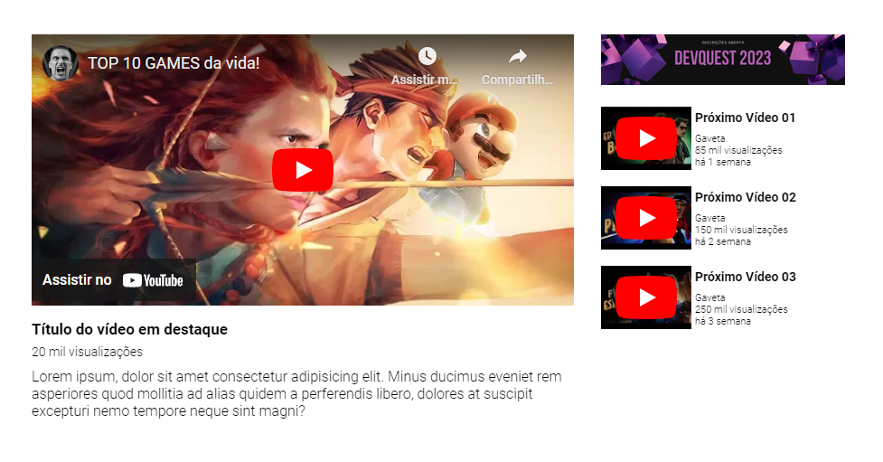

<h1 align="center">Layout Youtube ▶️</h1>

Desafio Html/Css avançado do curso DevQuest. O arquivo com as informações de configuração, tamanho de fonte e outros foram disponibilizados pelo Figma.

 
 <h2>🕹️ Tecnologias Utilizadas</h2>
    <ul align="center">
        
        
    </ul>

 

<h2 align="center">⚔️ Quest Avançado - Dev em dobro</h2>
 
O desafio era criar um layout baseado no Youtube. Abaixo temos uma imagem da página criada:
 

<i>Página do desafio</i>

<h2 align="center">🔗 Link da página</h2>

Logo abaixo temos o link da página para visualização e testes:

👉 <a href="https://oseiasweb.github.io/Layout-Youtube/" target="_blank">Layout Youtube</a>  

<h2 align="center">🏆 Status Projeto</h2>

 

